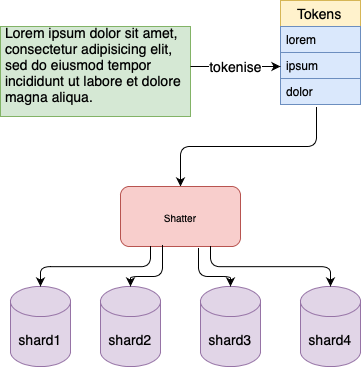
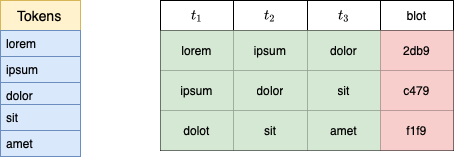

# ⊧ dupi -- design

Dupi is a tool for finding duplicated data in a large and noisy 
set of documents.

This document describes the design of dupi.

## Background

In this section we describe some background concepts.

### Inverted Index

An inverted index takes as input a set of documents and produces 
a list of posts for elements in each document.

For example, given
```
1. There are lots of duplicate Go packages.
2. There are lots of cool and interesting Go modules.
3. I like Go.
4. And who doesn't?
```

An inverted index may look like this

```
there: 1, 2
are: 1, 2
lots: 1, 2
of: 1, 2
duplicate: 1
go: 1, 2, 3
packages: 1
cool: 2
and: 2, 4
interesting: 2
modules: 2
i: 3
like: 3
who: 4
doesn't: 4
```

### Documents

Documents may be files, web pages, chat posts, ....

### Elements

Note that there are always questions of identifying the elements in the documents:
are they words?  Are they case-folded?  What about punctuation?

Some common ways of treating this are:

- use trigrams (like [codesearch])
- detect language, tokenize and stem the input (like [Lucene])
    - use named entity recognition.
    - use part of speech tagging.

 
### Post lists

Representation of posting lists is a field of study because they tend to present 
challenges.  They can grow to be very large.  There tends to be an exponential 
distribution of elements which are indexed.  Exactly which set of words may be
interesting is challenging (for example if we exclude "the" because it is too
common, will we be able to find the band "The The"?).

Post lists are most commonly compressed by storing differences between successive
document ids in sorted order with a variable length encoding.

## Dupi Overview

dupi works in the paradigm above of inverted indices, with a few substantial
twists.  Here is the flow for creating a dupi index from a document:



### Tokenisation

The first step tokenizes the input.  Different tokenisation schemes can be used
for different kinds of input.  For example, a simple case fold and filtering
of all non alphanumerics can be a simple, generic tokeniser.  Using Go's 
unicode support, this should work accross languages.

Other tokenisation schemes can be interesting as well.  For example, to find
duplicative code, we could include tokens for '{([])}' and operators, and map
variable names to names for their types.  Dupi provides extendable and pluggable
tokenizers.

### Fingerprinting (blots)

Dupi _shatters_ each document accross a set of shards by translating
each document into a sequence of micro-fingerprints called _blots_.

#### Blots

Blots must be roughly evenly distributed for a document set.  As a 
result, one cannot use letters or words as the defining parameters of
a blot, as letters and words generally occur in exponential distribution.
If blots are not roughly evenly distributed, then the space of potential
duplicates increases, which is undesireable. 

This can in principle be accomplished any number of ways, and Dupi
allows extending and plugging in blotter.T objects of any sort.  A 
few basic blottering techniques are provided.

First, dupi _tiles_ the token stream into tiles of sufficient size
to have near-uniform distribution.  Second, dupi computes a blot
for each tile, as indicated in the digram below.




#### k-Circular Hash Xor 

The blot computation uses a k-circular hash mechanism as follows.  Let t₁ t₂ t₃
… be a stream of tokens and fₕ be a hash function from tokens to uint32s.

The hash value of a k-window of tokens rooted at token 1 is defined to be
```
h₁ ≐ fₕ(t₁) ⊕ fₕ(t₂) ⊕ … ⊕ fₕ(tₖ)
```

We can then advance to the next hash value with
```
hᵢ₊₁ ≐ hᵢ ⊕ fₕ(tᵢ) ⊕ fₕ₊ᵢ(tₖ₊ᵢ₊₁)
```

This can be easily implemented in a circular buffer of hash values.

This provides us with a translation from a document to a stream of fingerprints
of windows of text.  Small values of 'k', like 2-3, may lead to a sharper
frequency distribution of the fingerprints.  However, such values do not provide
much information about duplicative text, so let's assume 'k' is large enough to
provide near-uniform distribution of the fingerprints over the documents.
Later, we can exploit this property.

#### Interleaving k-Circular Hash Xor

While the fingerprints above probably would capture cut-and-paste duplicates or
message quotes with a simple tokenisation scheme, it is not so robust for
noisier duplicates, such as would occur with OCR scanning errors or different
treatment of "doesn't", due to the apostrophe, in different contexts.  In this
section, we present an alternative blotting scheme which is more robust to such
fuzzy matches.

The idea is simple:  Given a tokenized document, we create 2 fingerprint streams
based on even and odd indexed tokens, so one stream does a k-circular hash of
even tokens and the other a k-circular hash of odd tokens.  When we process an
even token, we output the fingerprint from the even stream and likewise for the
odd stream.  A query will then consider a possible match either of the two
streams matches.

#### Example

Suppose we are looking at code documentation for 10 million LoC distributed
over a few million source code files and maybe a 1 million documented items in
the code.  Let's consider a dupi document to be a documented item in this code
base.

So we estimate 1m dupi documents, each of which is fairly short.  dupi uses
hash based fingerprinting of a sliding window of text.  So let's say on average
we can assume there will be 100 fingerprints per document.  That gives us 100
million posts which is the product of the fingerprints per document and the
number of documents.  

Suppose we allow for 2¹⁸ distinct fingerprint values, as is the current default
for dupi.  Then on average we will have about 200 documents per blot, and each
document will contain about 100 blots, making the expected number of possible
documents with duplicate blots 20000, independent of their actual content.

By looking up the 200 or so documents associated with a blot, we have ruled out
999800 documents having a duplicate of the text associated with the blot.  
Exploiting this fact to efficiently find all duplicate text is discussed in the
extraction and query sections below, where relatively cheap per-blot processing
can be iterated over all or a subset of blots.  By focusing on the data
blot-wise, we effectively reduce the N² nature of the find all duplicates query
to worst case |blots|x|per-blot-processing-time| query, which in this example is
_much_ smaller than N².

### Posting Lists

Dupi posting lists are the main component of shards in dupi.  Each shard
contains a posting list, and each _blot_ indicates a pair of a shard and a value
associated with documents in the posting list.

Posting lists are then an on-disk storage which maps blot shard values (16 bits)
to lists of document ids.  This is accomplished in dupi by an on-disk linked
list which allows each blot value to store chunks of compressed integers at each
list node.  On-disk linked list allows for fast appends and reasonable iteration
through blot data.

The document ids are by construction increasing in value, so they are
delta-encoded and then varuint encoded to save space.

Along with posting lists, dupi stores the size of each list.  As in [^lucene]
posting lists are built in a limited memory fashion allowing the indexing of
large document sets.

On plain English text, the posting lists take about 25% the size of the 
input data.

## Extraction

Dupi provides a command to extract duplicates or candidate duplicates from
a set of indexed documents.

On startup, dupi sorts the blots in descending order of frequency of associated
documents, based on the idea that a blot with many documents is more likely to
represent duplicate text than a blot with an expected number of associated
documents just based on the document number and size and the uniform-ish
distribution of shattering. 

The extraction mechanism visits the blots in descending frequency order, 
and outputs the blots and document occurences, in one per line or json formats.
Extraction is parameterised on the standard deviation of the distribution of
the number of documents associated with blots.  One can restrict to those
blots which have frequency not less than the mean μ + σ by specifying σ as
a command line parameter.  The lower the value of σ, the more output and
the more likely the number of co-occurrences of snippets with the same blot
decreases.

Extraction can output the associated documents one per line, or in json format,
giving a consumer a much-reduced set of pairs of documents to analyse.  This raw
form can produce a lot of documents and does not by itself show or test the
associated text.

The extraction mechanism composes with the dupi 'unblot' verb, which does the
inverse of blotting: given a blot, it finds the set of associated texts and the
documents in which they appear.  This step provides the actual duplicated text
and associated documents, removing the noise from the more approximate mechanism
of extraction by shared blot.

### Query

Query works exactly like extraction, except we restrict the set of blots
visited to those which have a hit for the input document or set of 
documents.


## Concurrent Design

The indexing engine has 2 components which operate concurrently. First, the
index is broken into shards, and there is one goroutine for adding to each
shard.  Second, the tokenisation and shattering operates with several
goroutines, processing documents in parallel.  These elements are coordinated
with channels.  A sync.Cond is used to guarantee that shattered document posts
arrive at the shards in increasing order of document id. 

On the query side, each query has a dedicated goroutine and multiple such
queries can be executed at once.  Queries present an iterative interface
allowing back-and-forth communication between the a client, such as the command
line, and the index server.  All i/o operations on the query side are concurrent
safe, using io.ReadAt, so many queries share the underlying file descriptor 
for every shard.  This makes it easy to scale in terms of number of 
concurrent queries.

## Future Work

### Taboo List

It can happen, such as in software repositories, that many files have some
boilerplate headers, such as copyright notices.  It can be inconvenient to 
filter out such data before indexing.  If Dupi allows to manage a taboo list,
which is a (presumable small) set of documents which are duplicated but not
interesting, (such as copyright notices), that could go a long way to making the
output more interesting.

### Blot merging

Given a blot which is part of duplicated text, there are likely other related
blots.  It would be nice to merge these by re-shattering the associated document
like unblot does but then additionally solving a weighted, multidocument 
variation of the longest common subsequence problem in order to output the full
duplicated text and associated documents. 

### Input validation/filtering

It would be nice to validate utf8 correctness of input and filter out
binary files automatically.


### Workflows

Some large document set review workflows need a feedback loop, perhaps more
involved than just a taboo list.  While Dupi supports appending to an index,
workflows need to be defined and put in place for managing continuously 
growing document sets, and/or perhaps deleting documents.

### Go

Write a, or some, tokeniser(s) for Go which find cut n paste code.

### Generic programming languages

Idem, but just using different tokenizers.

### Improved Blotting

Blotting gives a function which is blind to the order of the tile 
to which it is applied.  What alternatives are there, what properties
do they have w.r.t. the end result?

### Explore DNA sequence duplicates

Dupi is built for large data sets, and looking at things like BLAST [blast]
it seems this kind of token-shatter-index architecture could be applied
with success at the DNA sequence level.

## Related Work

[lsh] Locality sensitive hashing was first used to remove similar items from
altavista search in the late 90s.  Dupi is designed to find duplicative text,
such as results of cut and paste, with associated formatting noise.  While
duplicative text is very similar, it can be embedded in documents which are very
disimilar.  As a result, LSH would need to be applied at a micro level for dupi,
which does not seem to scale.

From a broader perspective, dupi creates an index which makes it easy to rule
out possible pairs of documents which contain duplicative text, whereas LSH is
generally applied in a context where one searches for similar documents.  By
focusing on ruling out possible document pairs, dupi scales more easily.

Bloom filters [bloomfilters] have an interesting relationship to Dupi. In fact,
we started out with (and then rejected) Bloom filter based posting lists for
blots.  However, a Dupi index is very much like a bloom filters.  Bloom filters
are parameterized on a number of bits, m, and a number of elements used to
identify elements in the set, k, with k less than m.  Two elements are in a set
if their k true bits are all true in the set's m-bit representation.

If one thinks of the space of values of (shard, blot) tuples, one gets |shards|
x |blots| bits which can be true or false in a document.  Unlike a Bloom filter,
a document does not have a fixed number of k bits true.  Rather, longer
documents will have more blot values, and membership in a set of candidate
paired documents can be established, rejected, and estimated by looking at the
degree of overlap of blots.  Like a Bloom filter, Dupi indices can safely
_reject_ a large set of possibly duplicative documents, as all those documents 
whose blots do not overlap.

## Conclusions

Dupi is novel, fast, flexible, effective and scalable mechanism for finding
duplicates over large sets of data.  Currently a beefy machine can easily scale
to a billion documents.  dupi is not yet however distributed so we do not yet
scale to hundreds or thousands of terabytes of documents.  

## References

[codesearch](https://github.com/google/codesearch)
Russ Cox's codesearch.

[codesearchblog](https://swtch.com/~rsc/regexp/regexp4.html)

[lucene](https://lucene.apache.org): Apache Lucene.

[bloomfilters](https://en.wikipedia.org/wiki/Bloom_filter)
Wikipedia on Bloom filters.

[bloomcalc](https://hur.st/bloomfilter/)
Bloom Filter parameter calculator.

[lsh](https://en.wikipedia.org/wiki/Locality-sensitive_hashing)
Locality Sensitive Hashing. Wikipedia article

[mg](https://people.eng.unimelb.edu.au/ammoffat/mg/) Managing Gigabytes: Compressing and Indexing Documents and Images by Ian H. Witten, Alistair Moffat, and Timothy C. Bell, was published in May 1999 by Morgan Kaufmann Publishing, San Francisco (now a component of Elsevier Publishing), ISBN 1-55860-570-3.

[zoekt](https://github.com/google/zoekt). Zoekt code search. 

[lshforest](http://infolab.stanford.edu/~bawa/Pub/similarity.pdf) LSH Forest: Self-Tuning Indexes for Similarity Search.  Mayank Bawa, Tyson Condie, Prasana Ganesan

[blast](https://blast.ncbi.nlm.nih.gov/Blast.cgi) BLAST basic local alignment search 
tool.
